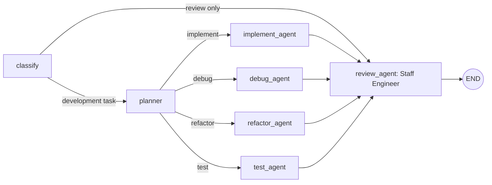

# Development Agent Graph

A runnable LangGraph example focused on software development. A request is routed
to an implementation, debugging, refactoring, testing, or staff engineer review agent.
Proposed changes pass through planning and an independent staff review, with each
agent sharing its work through graph state.

The agents produce **text proposals**: plans, code suggestions, tests, and review
findings. With a selected workspace, they can list and read relevant source files.
You can also supply code, logs, and constraints through individual context files.
File editing and command execution are not implemented; results remain proposals
and reviews.

## The graph



| Node | Responsibility |
| --- | --- |
| `classify` | Select a development task using deterministic intent and keyword rules. |
| `planner` | Define acceptance criteria, an approach, affected areas, and validation steps. |
| `implement_agent` | Propose feature code and explain integration and edge cases. |
| `debug_agent` | Identify reproduction steps, likely causes, a targeted fix, and regression checks. |
| `refactor_agent` | Improve code structure while preserving behavior and public interfaces. |
| `test_agent` | Propose tests covering expected behavior, boundaries, and failures. |
| `review_agent` | Act as the team's staff engineer: assess architecture, correctness, reliability, security, maintainability, and release risks; prioritize findings and validation. |

Leading intent takes precedence: `Write tests for this bug` routes to testing,
`Fix failing tests` to debugging, and `Review this refactor` directly to review.
If no leading intent matches, keywords are checked in review, refactor, debug,
then test order. Requests without a match default to implementation. The router
is deliberately lightweight; ambiguous requests may need clearer wording or a
more capable classifier.

For development tasks, the final answer includes the plan, specialist proposal,
and review findings. Review-only requests return the review. Review is advisory:
findings are reported without an automatic revision loop or an approval gate.
The staff engineer gives an evidence-based advisory verdict, separates blocking
findings from suggestions, and explains tradeoffs and remaining validation.

## Models

The planner and development specialists use `claude-sonnet-5`. The staff engineer
uses **`claude-fable-5-1` with maximum reasoning effort** and adaptive thinking.
This default was selected on September 9, 2026, based on Anthropic's description
of [Claude Fable 5.1](https://www.anthropic.com/claude/fable) as its most capable
model for coding. It is a pinned model choice, not an automatic latest-model lookup.

Development responses have an explicit 8,192-token output limit so code proposals
and tool requests do not inherit the older integration's 1,024-token default.

The reviewer has a 64,000-token output limit covering thinking and answer text,
with streaming handled internally. Only answer text enters graph state. Empty
or truncated responses raise an error instead of being presented as a completed
review. Maximum effort favors review depth and can take longer and cost more;
see Anthropic's [effort guidance](https://platform.claude.com/docs/en/build-with-claude/effort).

Override the staff engineer's model independently through `ANTHROPIC_REVIEW_MODEL`:

```powershell
$env:ANTHROPIC_REVIEW_MODEL = "claude-fable-5-1"
```

Overrides must support adaptive thinking, `max` effort, and the configured output
limit. A missing or blank override uses the default. API errors surface directly;
the reviewer does not silently fall back to a less capable model. Without
`ANTHROPIC_API_KEY`, both model profiles use the offline stubs.

## Running it

From PowerShell on Windows:

```powershell
python -m venv .venv
.\.venv\Scripts\python.exe -m pip install -r requirements.txt
.\.venv\Scripts\python.exe main.py
```

On macOS or Linux, use `.venv/bin/python` in place of
`.\.venv\Scripts\python.exe`.

Starting without a request opens an interactive prompt. Type a task, press Enter,
and enter another task after the answer appears:

```text
You> /context graph_agents/agents.py
You> Review this module for correctness and performance
You> Write unit tests for this module
You> /exit
```

| Command | Action |
| --- | --- |
| `/workspace PATH` | Select a codebase folder for all agents; switching folders clears the previous context. |
| `/workspace` | Show the selected folder. |
| `/context PATH` | Load a UTF-8 context file for subsequent requests. Paths with spaces may be quoted. |
| `/context` | Show the selected file. |
| `/clear` | Clear the selected context. |
| `/help` | Show available commands. |
| `/exit` | Exit; `/quit`, `exit`, and `quit` also work. |

You can preload the context file when starting a session:

```powershell
.\.venv\Scripts\python.exe main.py --context-file context.md
```

Each request starts fresh; prior requests and answers are not conversation
history. Selected file contents are reused until you load another file or clear
them. Run `/context PATH` again to refresh a file after editing it. A failed file
load preserves the previous context.

Select the codebase at startup:

```powershell
.\.venv\Scripts\python.exe main.py --workspace "C:\Users\Naji\Repos\my-project"
```

Or select or switch folders from the prompt:

```text
You> /workspace "C:\Users\Naji\Repos\my-project"
You> Review the authentication code for correctness
You> /workspace "C:\Users\Naji\Repos\another-project"
You> Explain the application structure
```

You can also use `--workspace` with a single request. A workspace must be an
existing directory. Relative startup workspace paths resolve from the launch
directory. Once selected, relative `/workspace`, `/context`, and `--context-file`
paths resolve from that workspace. Absolute paths and quoted paths with spaces
are supported. Failed folder selections preserve the current workspace and context.
`/clear` clears the extra context file and keeps the workspace selected.

Every agent receives the same folder and can call `list_workspace_files` and
`read_workspace_file` to inspect relevant code. File reads include line numbers.
The tools only read files and directories whose resolved paths stay within the
selected folder, including when resolving symlinks or Windows junctions. They skip
`.env*`, common credential files, and generated or dependency directories such as
`.git`, `.venv`, and `node_modules`. The exclusion rules are in
`graph_agents/workspace.py`; they do not implement `.gitignore` matching.
An explicitly supplied context file remains available as additional context.
The API key continues to load from this app's `.env`.

Inspection reads files on demand, with 200 directory entries per page, up to 300
lines and 24,000 characters per read, and a 1 MiB file-size limit. Binary files are
rejected. Each agent can make at most 16 inspection calls per request. Without an
API key the agents still use stubs and do not inspect code with model tools.

The CLI prints progress as each graph stage finishes and shows the final answer
after review. Request errors return you to the prompt. Ctrl+C cancels a running
request; Ctrl+C at the prompt or end-of-input exits the session.

Without `ANTHROPIC_API_KEY`, every agent uses a deterministic, clearly marked
stub. Stubs demonstrate traversal; they do not generate or validate real code.
The five built-in examples are available explicitly with `--examples`:

```powershell
.\.venv\Scripts\python.exe main.py --examples
```

With an API key configured, these examples make 13 model calls in total.

To run a single request and exit, pass it as an argument, optionally supplying
a UTF-8 context file:

```powershell
.\.venv\Scripts\python.exe main.py "Implement pagination for a Python API endpoint"
.\.venv\Scripts\python.exe main.py "Refactor this module while preserving behavior" --context-file graph_agents/agents.py
.\.venv\Scripts\python.exe main.py "Review this code for correctness" --context-file graph_agents/graph.py
```

To use Claude, set your key once in the project's `.env` file. If the file is
missing, copy `.env.example` to `.env`, then edit this line:

```dotenv
ANTHROPIC_API_KEY=your-api-key
```

If your API key is not scoped to an Anthropic workspace, also set the account
workspace ID in `.env`:

```dotenv
ANTHROPIC_WORKSPACE_ID=wrkspc_your_workspace_id
```

Copy the ID from the **ID** column in **Claude Console > Settings > Workspaces**.
The app sends it as the `anthropic-workspace-id` header on requests from every
agent, including tool follow-ups. This Anthropic account workspace is separate
from the local folder selected with `--workspace` or `/workspace`. Leave the ID
blank when using an API key already scoped to a workspace. See
[Anthropic authentication](https://platform.claude.com/docs/en/manage-claude/authentication#select-a-workspace).
Restart the CLI after changing these settings.

The shared model client uses [python-dotenv](https://bbc2.github.io/python-dotenv/)
to load this file into the Python process environment for every agent, whether
you run the CLI or call the graph from Python. The path is relative to the
project, so it also works when launched from another directory. `.env` is
excluded from Git; `.env.example` is the shareable template.

Restart the script (or Python session) after editing `.env`. Existing environment
variables take precedence, including an explicitly empty value. This loads
settings for the application; it does not change Windows user or system variables.
You can still set a key directly in PowerShell for a session:

```powershell
$env:ANTHROPIC_API_KEY = "your-api-key"
.\.venv\Scripts\python.exe main.py "Write unit tests for this module" --context-file graph_agents/agents.py
```

With a key set, the request and supplied context are sent to the configured model
in `graph_agents/llm.py`. Without workspace tools, a development task makes three
model calls (planner, specialist, reviewer); a review-only task makes one.
Workspace inspection adds model calls as each agent requests and processes tool
results. To return to offline stubs,
clear the value in `.env` and remove any session override before restarting:

```powershell
Remove-Item Env:ANTHROPIC_API_KEY -ErrorAction SilentlyContinue
```

To return to the `.env` value after using a PowerShell override, remove the
session variable with the same command and restart the script.

## Calling the graph from Python

```python
from graph_agents import build_graph

app = build_graph()
result = app.invoke({
    "query": "Debug division by zero for an empty list",
    "context": "def average(values): return sum(values) / len(values)",
})
print(result["answer"])
print(result["steps"])
```

Only a non-empty `query` is required. Optional `context` supplies source code,
logs, or repository notes. Optional `workspace` is the codebase directory path
and enables the same inspection tools when calling the graph from Python.
Nodes return partial state updates that LangGraph
merges before the next node runs. The state also holds `route`, `plan`, `draft`,
`review`, `answer`, and the traversal trace in `steps`. Classification clears
previous output artifacts so a new request does not reuse an old proposal.

## Validation

```powershell
.\.venv\Scripts\python.exe -m unittest discover -s tests -v
```

Tests run offline even if an API key is configured. They cover routing precedence,
all five graph paths, context and artifact handoffs, review-only behavior, empty
requests, CLI context-file handling, and staff reviewer model configuration and output.
They also cover interactive requests, session context, cancellation, error
recovery, streamed graph progress, and environment variable precedence.
Workspace checks cover folder selection, state handoffs, file reads, exclusions,
path traversal, inspection limits, and tool-message round trips through both
provider profiles. The symlink check skips on systems without symlink privileges.

## Layout

```text
graph_agents/
  state.py    # Development routes and shared GraphState
  agents.py   # Router, planner, development specialists, and reviewer
  graph.py    # Compiled graph and conditional edges
  llm.py      # Development/staff review model profiles and offline stubs
  workspace.py # Workspace selection and read-only file inspection tools
main.py       # Interactive prompt, single-request CLI, and explicit examples
tests/        # Offline routing, graph, and CLI checks
```
