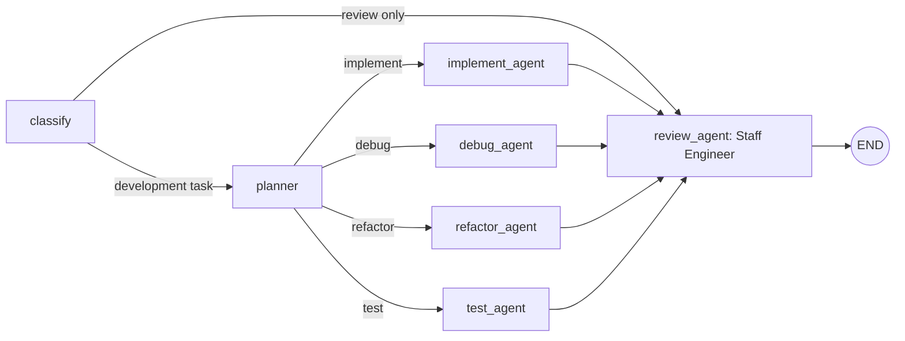

# Development Agent Graph

A runnable LangGraph example focused on software development. A request is routed
to an implementation, debugging, refactoring, testing, or staff engineer review agent.
Changes pass through planning, a development specialist, and an independent staff review, with each
agent sharing its work through graph state.

With a selected workspace, development specialists **create and edit files on
disk** for implementation, debugging, refactoring, and test-writing requests.
Planning and review are read-only. The staff reviewer receives the confirmed list
of changed files and can inspect their saved contents. Without a workspace or
an API key, the app produces proposals or offline demonstrations without writes.
You can supply additional code, logs, and constraints through context files.
Command execution is not implemented: agents can write tests but cannot run them.

## The graph



| Node | Responsibility |
| --- | --- |
| `classify` | Select a development task using deterministic intent and keyword rules. |
| `planner` | Define acceptance criteria, an approach, affected areas, and validation steps. |
| `implement_agent` | Implement feature code and explain integration and edge cases. |
| `debug_agent` | Identify reproduction steps, likely causes, a targeted fix, and regression checks. |
| `refactor_agent` | Improve code structure while preserving behavior and public interfaces. |
| `test_agent` | Write tests covering expected behavior, boundaries, and failures. |
| `review_agent` | Act as the team's staff engineer: assess architecture, correctness, reliability, security, maintainability, and release risks; prioritize findings and validation. |

Leading intent takes precedence: `Write tests for this bug` routes to testing,
`Fix failing tests` to debugging, and `Review this refactor` directly to review.
If no leading intent matches, keywords are checked in review, refactor, debug,
then test order. Requests without a match default to implementation. The router
is deliberately lightweight; ambiguous requests may need clearer wording or a
more capable classifier.

For development tasks, the final answer includes the plan, specialist result,
and review findings. Review-only requests return the review. Review is advisory:
findings are reported without an automatic revision loop or an approval gate.
Edits are saved before review and remain on disk if review fails or the request
is cancelled. The CLI lists confirmed saved paths even when later work fails;
it explicitly reports when no files changed.
The staff engineer gives an evidence-based advisory verdict, separates blocking
findings from suggestions, and explains tradeoffs and remaining validation.

## Models

The planner and development specialists use `claude-sonnet-5`. The staff engineer
uses **`claude-fable-5-1` with maximum reasoning effort** and adaptive thinking.
This default was selected on September 9, 2026, based on Anthropic's description
of [Claude Fable 5.1](https://www.anthropic.com/claude/fable) as its most capable
model for coding. It is a pinned model choice, not an automatic latest-model lookup.

The planner and development specialists have a 32,768-token output limit per
model call, including follow-up calls after file inspection or edits.
These limits cover thinking and answer output; they are ceilings, not amounts
the model must use. The larger planning allowance gives complex tasks more room
and can increase runtime and usage when that extra capacity is used.
Both model profiles stream with adaptive thinking; the CLI displays activity
without printing internal reasoning.

The reviewer has a 64,000-token output limit covering thinking and answer text,
with streaming handled internally. Only answer text enters graph state. Empty
responses raise an error. Maximum effort favors review depth and can take longer and cost more;
see Anthropic's [effort guidance](https://platform.claude.com/docs/en/build-with-claude/effort).

Configure output budgets separately in `.env` and restart the CLI:

```dotenv
ANTHROPIC_PLANNING_MAX_TOKENS=32768
ANTHROPIC_DEVELOPMENT_MAX_TOKENS=32768
ANTHROPIC_REVIEW_MAX_TOKENS=64000
```

Values must be positive integers supported by the selected model. Blank values
use the defaults; process environment values take precedence. These output
budgets are separate from the workspace inspection allowance.

When terminal input is available, hitting `max_tokens` pauses the current agent
and shows **Awaiting input**. The CLI asks whether to increase the output allowance:

```text
Implementation reached its 32,768-token output limit.
Enter y for 65,536, a larger token count, or n to stop.
Token limit>
```

Enter `y` to approve the suggested increase, or enter a custom integer such as
`64000`. The same agent resumes with its accumulated context, remaining tool
allowances, and saved changes. Its subsequent calls use the approved limit for
this task only; other agents, future requests, and `.env` are unchanged. If it
hits the new limit, it asks again. If the provider rejects the chosen `max_tokens`,
the CLI asks for a different supported value. `n`, Ctrl+C, or end-of-input stops
the task and retains saved files. Waiting progress lives in memory while the CLI
stays open; this is not a checkpoint that can resume after closing the process.

Incomplete generations are discarded before any of their tool calls execute;
confirmed edits are never replayed. The live display pauses during input and
resumes afterward. When standard input is not a terminal, or the graph is called
directly from Python without a budget controller, there is no prompt and the bounded automatic retry
remains available: once per agent invocation. That retry
requests smaller responses and file changes, with an output allowance doubled
up to 64,000 tokens (an existing allowance of 64,000 or more is retained).
Subsequent tool rounds return to the configured allowance. Earlier successful
file operations are preserved and are not replayed. The dashboard shows the
retry; a second truncation reports the profile and its environment setting.
Retries consume additional model usage. See Anthropic's
[truncation guidance](https://platform.claude.com/docs/en/build-with-claude/handling-stop-reasons).

Streaming API errors retain their original provider message, including with
langchain-core 0.3 versions affected by the
[`ResponseNotRead` error-formatting bug](https://github.com/langchain-ai/langchain/issues/33514).
The app recovers the original exception without trying to reread a consumed
HTTP stream. Temporary overload, rate-limit, timeout, and internal API error
events received inside an HTTP 200 stream get one retry per agent invocation,
after a visible two-second delay. Invalid requests are not retried by this path.
The failed generation is discarded; prior saved edits are preserved. A repeated
failure surfaces the original API error. Ordinary HTTP failures continue to use
the SDK's retry behavior. See Anthropic's
[streaming error events](https://platform.claude.com/docs/en/build-with-claude/streaming).

Override the staff engineer's model independently through `ANTHROPIC_REVIEW_MODEL`:

```powershell
$env:ANTHROPIC_REVIEW_MODEL = "claude-fable-5-1"
```

Overrides must support adaptive thinking, `max` effort, and the configured output
limit. A missing or blank override uses the default. API errors surface directly;
the reviewer does not silently fall back to a less capable model. Without
`ANTHROPIC_API_KEY`, both model profiles use the offline stubs.

## Running it

From PowerShell on Windows:

```powershell
python -m venv .venv
.\.venv\Scripts\python.exe -m pip install -r requirements.txt
.\.venv\Scripts\python.exe main.py
```

On macOS or Linux, use `.venv/bin/python` in place of
`.\.venv\Scripts\python.exe`.

Starting without a request opens an interactive prompt. Type a task, press Enter,
and enter another task after the answer appears:

```text
You> /context graph_agents/agents.py
You> Review this module for correctness and performance
You> Write unit tests for this module
You> /exit
```

| Command | Action |
| --- | --- |
| `/workspace PATH` | Select a codebase folder for all agents; switching folders clears the previous context. |
| `/workspace` | Show the selected folder. |
| `/context PATH` | Load a UTF-8 context file for subsequent requests. Paths with spaces may be quoted. |
| `/context` | Show the selected file. |
| `/clear` | Clear the selected context. |
| `/help` | Show available commands. |
| `/exit` | Exit; `/quit`, `exit`, and `quit` also work. |

You can preload the context file when starting a session:

```powershell
.\.venv\Scripts\python.exe main.py --context-file context.md
```

Each request starts fresh; prior requests and answers are not conversation
history. Selected file contents are reused until you load another file or clear
them. Run `/context PATH` again to refresh a file after editing it. A failed file
load preserves the previous context.

Select the codebase at startup:

```powershell
.\.venv\Scripts\python.exe main.py --workspace "C:\Users\Naji\Repos\my-project"
```

Or select or switch folders from the prompt:

```text
You> /workspace "C:\Users\Naji\Repos\my-project"
You> Review the authentication code for correctness
You> /workspace "C:\Users\Naji\Repos\another-project"
You> Explain the application structure
```

You can also use `--workspace` with a single request. A workspace must be an
existing directory. Relative startup workspace paths resolve from the launch
directory. Once selected, relative `/workspace`, `/context`, and `--context-file`
paths resolve from that workspace. Absolute paths and quoted paths with spaces
are supported. Failed folder selections preserve the current workspace and context.
`/clear` clears the extra context file and keeps the workspace selected.

Every agent receives the same folder and can call `list_workspace_files` and
`read_workspace_file` to inspect relevant code. File reads include line numbers.
The tools only read files and directories whose resolved paths stay within the
selected folder, including when resolving symlinks or Windows junctions. They skip
`.env*`, common credential files, and generated or dependency directories such as
`.git`, `.venv`, and `node_modules`. The exclusion rules are in
`graph_agents/workspace.py`; they do not implement `.gitignore` matching.
An explicitly supplied context file remains available as additional context.
The API key continues to load from this app's `.env`.

Development specialists additionally receive `create_workspace_file` and
`edit_workspace_file`. Creation makes missing parent folders and refuses to
overwrite existing files. Editing requires a prior read and a unique exact-text
match, checks that the file is unchanged since reading, and replaces it atomically.
Edits preserve UTF-8 BOM and existing CRLF line endings. Writes are limited to
UTF-8 files up to 1 MiB and share the workspace boundary and excluded-path rules;
writes through symlinks or junctions are rejected. There are no delete or shell
tools. Each specialist has at most 32 write attempts, separate from inspections.

Inspection reads files on demand, with 200 directory entries per page, up to 300
lines and 24,000 characters per read, and a 1 MiB file-size limit. Binary files are
rejected. Each agent gets its own inspection budget per task, defaulting to 16
calls. Directory listings, file chunks, and failed attempts each consume one call.
To allow more inspections, set a positive integer in this app's `.env`, for example:

```dotenv
WORKSPACE_INSPECTION_LIMIT=64
```

Restart the CLI after editing. A blank setting uses 16; environment variables
take precedence over `.env`. Higher limits can increase model usage and runtime.
The agent receives its remaining budget after each group of tool calls. At the
limit, further inspections are disabled. Specialists can still use their separate
write allowance for already-read files and new files. Planning and review move
directly to a final response. When all tool allowances are exhausted, tools are
disabled for one final model request. The response is labeled as limited inspection,
and subsequent agents continue with their own budgets. Excess tool calls in a
batch receive a result explaining that they were not executed. Empty responses,
repeated truncation, and API failures still report an error.
Tool disabling uses Anthropic's documented
[`tool_choice: {"type": "none"}`](https://platform.claude.com/docs/en/agents-and-tools/tool-use/define-tools).
Without an API key the agents use stubs and do not inspect code with model tools.

The CLI uses a live Rich dashboard with a progress bar for the router, planner,
selected specialist, and staff reviewer. Each row shows its status, elapsed time,
and reported output token usage. The activity panel shows model requests,
thinking or response generation, and the paths of files being inspected. Model
call and file-read counters cover the whole request. Each agent's remaining
inspection allowance stays visible, including after completion. Saved file counts
and paths come from successful tools, not model claims. Reaching the
limit is marked separately from request failures.

Active bars animate until the agent finishes, then become full green bars.
The model does not supply a completion percentage, so token usage is not treated
as a percentage or time estimate. Review-only requests mark unused stages as
skipped. Final plans, development results, and reviews appear in formatted Markdown panels.
Redirected output and basic terminals use plain logs.

Request errors return you to the prompt and mark the failed stage. Ctrl+C cancels
a running request; Ctrl+C at the prompt or end-of-input exits the session.

Without `ANTHROPIC_API_KEY`, every agent uses a deterministic, clearly marked
stub. Stubs demonstrate traversal; they do not generate or validate real code.
The five built-in examples are available explicitly with `--examples`:

```powershell
.\.venv\Scripts\python.exe main.py --examples
```

With an API key configured, these examples make 13 model calls in total.

To run a single request and exit, pass it as an argument, optionally supplying
a UTF-8 context file:

```powershell
.\.venv\Scripts\python.exe main.py "Implement pagination for a Python API endpoint"
.\.venv\Scripts\python.exe main.py "Refactor this module while preserving behavior" --context-file graph_agents/agents.py
.\.venv\Scripts\python.exe main.py "Review this code for correctness" --context-file graph_agents/graph.py
```

To use Claude, set your key once in the project's `.env` file. If the file is
missing, copy `.env.example` to `.env`, then edit this line:

```dotenv
ANTHROPIC_API_KEY=your-api-key
```

If your API key is not scoped to an Anthropic workspace, also set the account
workspace ID in `.env`:

```dotenv
ANTHROPIC_WORKSPACE_ID=wrkspc_your_workspace_id
```

Copy the ID from the **ID** column in **Claude Console > Settings > Workspaces**.
The app sends it as the `anthropic-workspace-id` header on requests from every
agent, including tool follow-ups. This Anthropic account workspace is separate
from the local folder selected with `--workspace` or `/workspace`. Leave the ID
blank when using an API key already scoped to a workspace. See
[Anthropic authentication](https://platform.claude.com/docs/en/manage-claude/authentication#select-a-workspace).
Restart the CLI after changing these settings.

The shared model client uses [python-dotenv](https://bbc2.github.io/python-dotenv/)
to load this file into the Python process environment for every agent, whether
you run the CLI or call the graph from Python. The path is relative to the
project, so it also works when launched from another directory. `.env` is
excluded from Git; `.env.example` is the shareable template.

Restart the script (or Python session) after editing `.env`. Existing environment
variables take precedence, including an explicitly empty value. This loads
settings for the application; it does not change Windows user or system variables.
You can still set a key directly in PowerShell for a session:

```powershell
$env:ANTHROPIC_API_KEY = "your-api-key"
.\.venv\Scripts\python.exe main.py "Write unit tests for this module" --context-file graph_agents/agents.py
```

With a key set, the request and supplied context are sent to the configured model
in `graph_agents/llm.py`. Without workspace tools, a development task makes three
model calls (planner, specialist, reviewer); a review-only task makes one.
Workspace inspection adds model calls as each agent requests and processes tool
results. To return to offline stubs,
clear the value in `.env` and remove any session override before restarting:

```powershell
Remove-Item Env:ANTHROPIC_API_KEY -ErrorAction SilentlyContinue
```

To return to the `.env` value after using a PowerShell override, remove the
session variable with the same command and restart the script.

## Calling the graph from Python

```python
from graph_agents import build_graph

app = build_graph()
result = app.invoke({
    "query": "Debug division by zero for an empty list",
    "context": "def average(values): return sum(values) / len(values)",
})
print(result["answer"])
print(result["steps"])
```

Only a non-empty `query` is required. Optional `context` supplies source code,
logs, or repository notes. Optional `workspace` is the codebase directory path
and enables the same inspection and specialist editing tools when calling the graph from Python.
Nodes return partial state updates that LangGraph
merges before the next node runs. The state also holds `route`, `plan`, `draft`,
`review`, `answer`, confirmed paths/actions in `changed_files`, and the traversal trace in `steps`. Classification clears
previous output artifacts so a new request does not reuse an old proposal.

## Validation

Run tests from the project root using module discovery:

```powershell
.\.venv\Scripts\python.exe -m unittest discover -s tests -v
```

In VS Code, open `graph-engineering-example` itself as the workspace folder.
Under **Run and Debug**, choose **Development Agent CLI** to run the app,
**Tests: all** to debug the suite, or **Python: current file (project imports)**
to debug the open test file. These configurations use the project's `.venv`.
The current-file configuration also sets `PYTHONPATH` to the project root,
fixing `ModuleNotFoundError: No module named 'graph_agents'` when launching a
file inside `tests/` directly. The Testing sidebar is configured for unittest
discovery; select the `.venv` interpreter there if VS Code retained another one.
See the [VS Code Python debugging documentation](https://code.visualstudio.com/docs/python/debugging).

Tests run offline even if an API key is configured. They cover routing precedence,
all five graph paths, context and artifact handoffs, review-only behavior, empty
requests, CLI context-file handling, and staff reviewer model configuration and output.
They also cover interactive requests, session context, cancellation, error
recovery, streamed graph progress, and environment variable precedence.
Dashboard checks cover stage statuses, bars, terminal widths, plain output,
and model/file activity events without source or reasoning content.
Workspace checks cover folder selection, state handoffs, file reads, exclusions,
path traversal, inspection limits, and tool-message round trips through both
provider profiles. Write checks cover real temporary-file changes, read-only roles,
read-before-edit, conflicts, exact matches, encoding, path boundaries, independent
budgets, and reviewer handoff using mocked HTTP. Symlink checks skip on systems
without symlink privileges.

## Layout

```text
graph_agents/
  state.py    # Development routes and shared GraphState
  agents.py   # Router, planner, development specialists, and reviewer
  graph.py    # Compiled graph and conditional edges
  llm.py      # Development/staff review model profiles and offline stubs
  budget.py   # In-task token-budget approval between CLI and graph workers
  progress.py # Agent lifecycle, model streaming, and activity events
  terminal.py # Rich dashboard, progress bars, and plain log fallback
  workspace.py # Workspace boundaries, inspection, and targeted file writes
main.py       # Interactive prompt, single-request CLI, and explicit examples
tests/        # Offline routing, graph, and CLI checks
```
