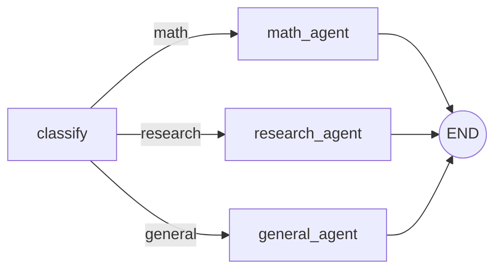

# Graph Engineering Example — Agents as a Graph

A minimal, runnable example of **graph engineering for agentic systems**: instead of
hard-coding a linear chain of prompts, you model an agent workflow as an explicit
graph of **nodes** (agents / processing steps) connected by **edges** (control flow,
including conditional routing based on shared state).

This is the pattern behind frameworks like [LangGraph](https://github.com/langchain-ai/langgraph),
used here, and the same shape shows up in most production multi-agent systems:
a router decides *which* specialist agent should handle a request, each specialist
reads and writes a shared state object, and the graph runtime handles traversal,
branching, and (in real systems) retries, human-in-the-loop interrupts, and
persistence.

## The graph



- **`classify`** is a router node: it inspects the incoming query and decides
  which specialist should handle it.
- **`math_agent` / `research_agent` / `general_agent`** are specialist nodes.
  Each is an independent agent with its own system prompt; in a bigger system
  these could each have their own tools, memory, or even be sub-graphs.
- **State** (`graph_agents/state.py`) is a single `TypedDict` threaded through
  every node. Each node returns a partial update; LangGraph merges it back in
  before handing control to the next node — this is how agents "communicate"
  without calling each other directly.
- **Edges** are declared once in `graph_agents/graph.py`. The conditional edge
  out of `classify` is just a function that reads state and returns a key —
  the graph engine does the dispatching.

## Why build it this way

Compared to an if/else chain of prompt calls, expressing this as a graph:

- makes the control flow **inspectable** (you can print/visualize the graph
  before running it),
- makes it easy to **add a node** (a new specialist, a validation step, a
  human-approval gate) without rewriting the surrounding logic,
- gives you a natural place to add **cycles** (e.g. a critique → revise loop)
  and **conditional branches** driven by model output rather than fixed code
  paths.

## Running it

```bash
python -m venv .venv
.venv\Scripts\activate
pip install -r requirements.txt
python main.py
```

By default there's no `ANTHROPIC_API_KEY`, so each specialist node falls back
to a deterministic stub answer (see `graph_agents/llm.py`) — the point of the
example is the graph's shape and traversal, which you can see either way in
the printed "Graph trace" for each query.

To see real model output from each agent, set an API key first:

```bash
set ANTHROPIC_API_KEY=sk-ant-...
python main.py
```

## Layout

```
graph_agents/
  state.py    # shared GraphState TypedDict
  agents.py   # node functions (one per agent)
  graph.py    # wires nodes + edges into a compiled graph
  llm.py      # Claude client, with a stub fallback when no API key is set
main.py       # runs a few example queries through the graph
```
